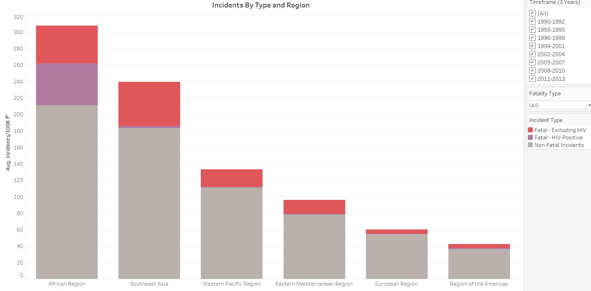
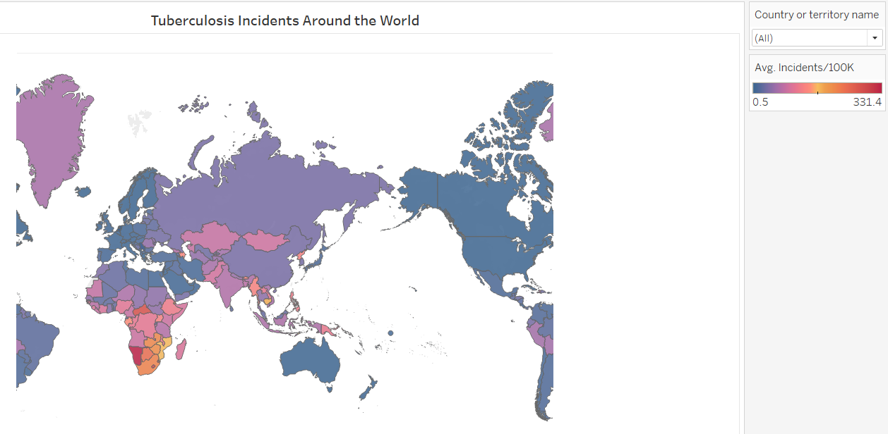
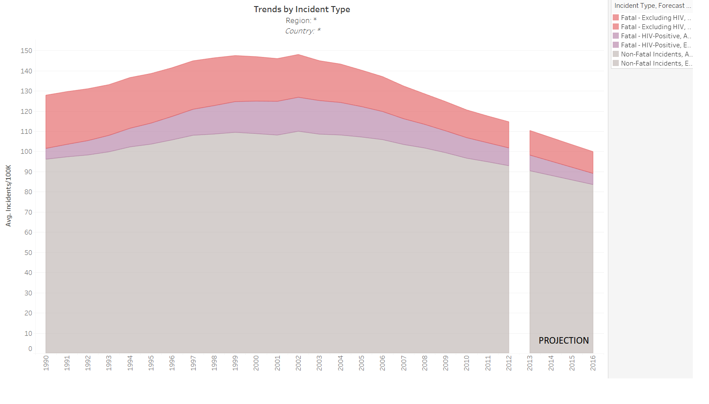
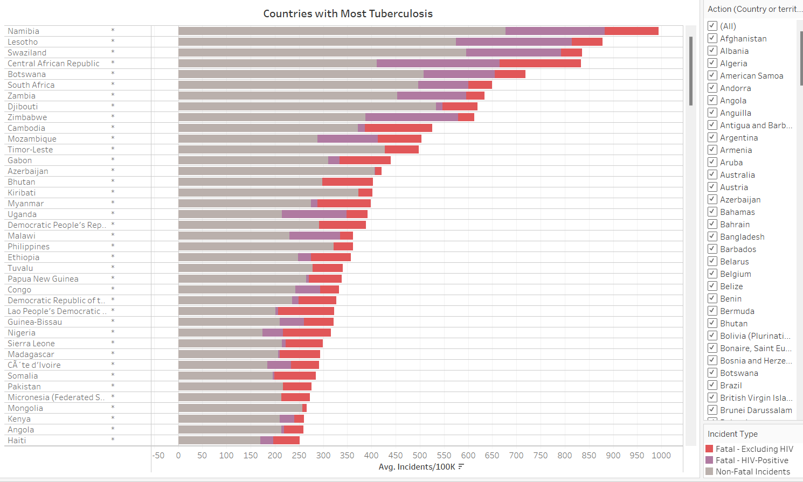
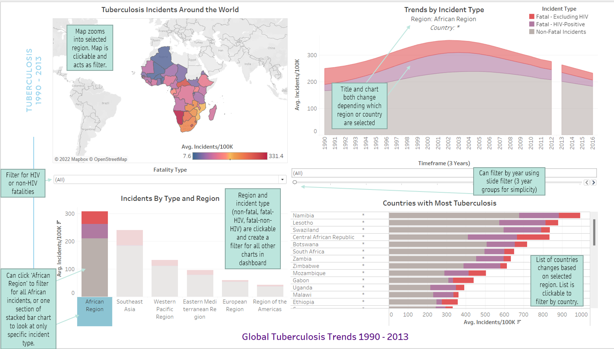
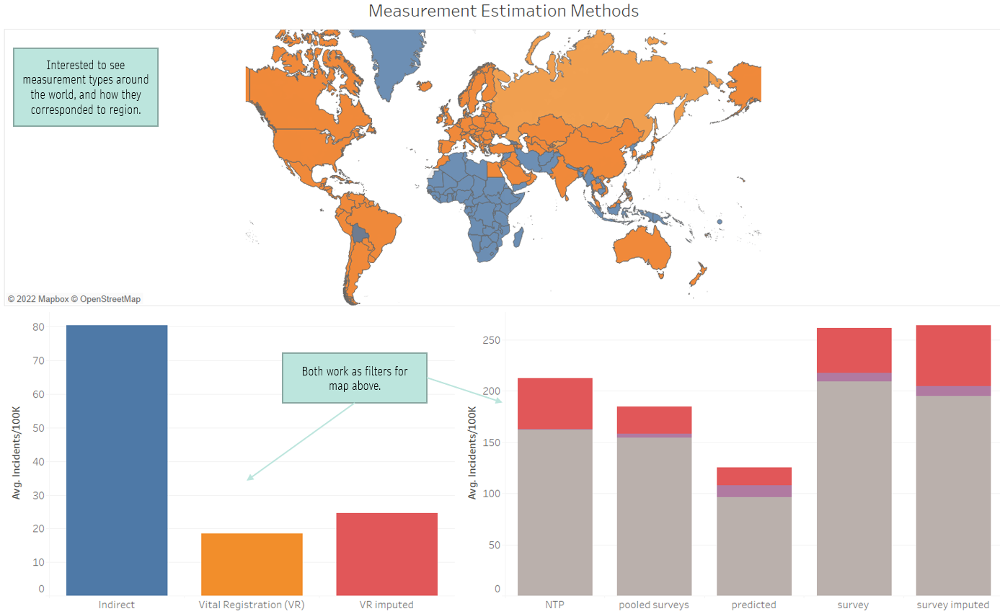
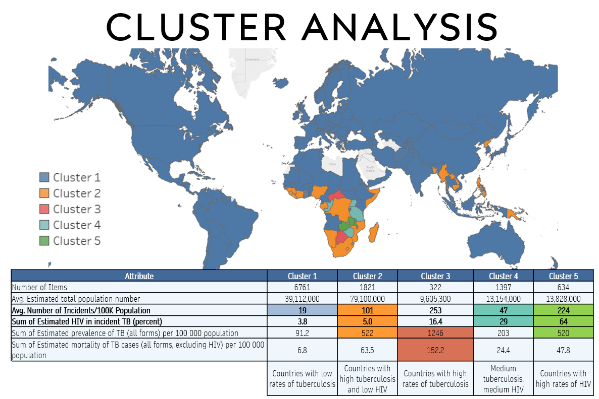

# Final-Project-Tableau

## <b>Overview</b>
I completed my project on the Tuberculosis Burden by Country, in which the World Health Organization estimates the prevalence and mortality of Tuberculosis by country. The data is available as a cleaned dataset from the WHO. 

## <b>Project/Goals</b>
I undertook this project with the mindset that this information could be helpful from a public health perspective, for example, for an NGO or government trying to implement public health interventions in the areas of the world hardest hit by tuberculosis. 

<b>Objectives</b>
- Investigate worldwide tuberculosis data (1990 – 2013) to understand  which countries have improved tuberculosis statistics
- Use to inform public health research for tuberculosis best practices

<b>Key Questions</b>
1. How has tuberculosis changed around the world over time (1990 - 2013)?
2. How are HIV cases around the world associated with tuberculosis cases and deaths?
3. Which countries in each region are hardest hit with tuberculosis?
4. In which regions/countries are HIV rates a factor in tuberculosis deaths?

## Process
### <b>1. Acquire and Clean Data</b>

The World Health Organization estimates the prevalence and mortality of Tuberculosis by country. I acquired the data from [TD_Burden_Country.csv](https://drive.google.com/file/d/1mRvMbGLzeYKCuELODUhbLYSXM-n6fbQ_/view?usp=sharing). 

Data cleaning steps were as follows: 
- Load data into a Jupyter notebook (included in repo)
- Checked country data for completeness
- Checked for null values
    - Most values given in the dataset was given with a 'high-bound' and 'low-bound' value, and most of the null values in the dataset were in the columns detailing 'high-bound' and 'low-bound' values. 
    - With more time, it would be interesting to use these high-bound and low-bound' values, but with limited time and with lots of nulls in that data, I decided not to use this data. 
- Other columns with missing values included: 
    - Method to derive incidence estimates
    - Estimated HIV in incident TB (percent)
    - Estimated incidence of TB cases who are HIV-positive per 100,000
    - population
    - Method to derive TBHIV estimates
    - Case detection rate (all forms)
- I left these in my dataset for use with caution but I didn't end up using any of these values in my dashboards

Key questions I had, that required some initial data wrangling, included: 
- how was HIV-positivity associated with death rates, and 
- which countries had higher rates of tuberculosis but lower fatality rates, and how was this associated with HIV?

<i>Note that with the time I had I was not able to fully answer these questions but with more tiime I would have liked to do an in-depth analysis into these questions</i>

To answer the question about whether tuberculosis incidents resulted in fatalities, I completed the following steps
    
1. Subtracted the number of fatalities (including and excluding HIV) from the number of incidents. This does not necessarily represent the exact number of non-fatal cases in a given year (since tuberculosis can be prevalent for years), but for this project, I used it as a proxy for non-fatal cases. This resulted in the incidents being split into three types of cases:
    - non-fatal
    - fatal - including HIV
    - fata  - no HIV
2. I unpivoted the three types of incidents so that each year for each country was listed for each of the three types of incidents.  

### <b>2. Load into Tableau</b>
Based on the cleaning step above, I had two tables to load into Tableau: 

1. Incident Types; and
2. TB Data Clean (with all other attributes from the dataset)

### Create visualizations to perform EDA and generally understand data and trends
Below are some of the visualizations I created trying to better understand the TB data: 

### <b>3. Improve visualizations to be dashboard-ready</b>
- I spent quite a bit of time tweaking selected  figures created during the EDA process to to work in a dashboard, including (for example):
- ensuring that filters were applied to multipe worksheets as needed
- ensuring colour schemes were consistent

### <b>4. Create dashboard with interactivity</b>
- I create a dashboard with interactivity with my visualizations. All of the visualizations can be used as filters for the other visualizations. I put a time filter based on 3-year grouped time frames to see change over time (but included it on a 3-year basis instead of 1-year basis for an simpler user interface). 

I created an additional dashboard to see the different measurement types for prevalence and mortality estimates. This one could use some tweaking, colour coordination, etc, but the bar charts can be used as filters to understand how measurements were completed in different countries. 

## <b>Results</b>
- In 1990-1992, Southeast Asia had more tuberculosis incidents per capita than any other region. However, from 1993 onwards, the Africa had more tuberculosis incidents per capita
- Many tuberculosis deaths in Africa are associated with HIV-positivity, this is uncommon elsewhere
- Djibouti, Namibia, Uganda, and South Africa are all consistently in the top 5 countries with the most tuberculosis
- Cambodia is the only country outside of the African Region which consistently is in the top 5 countries with the highest rates of tuberculosis

I completed a cluster analysis to understand the difference between the two regions. Findings are presented below. 

It is an interesting finding that the cluster analysis grouped nearly all of the countries in the world outside of Africa and a few in Southeast Asia. This may mean that there are only really two meaningful clusters. However, a careful investigation of the cluster analysis did reveal some general trends between clusters: 
|Cluster 1|Cluster 2|Cluster 3|Cluster 4|Cluster 5|
|---|---|---|---|---|
|Countries with low rates of tuberculosis|Countries with high tuberculosis and low HIV|Countries with high rates of tuberculosis|Medium tuberculosis, medium HIV|Countries with high rates of HIV|

## <b>Challenges</b> 
- The Tableau user interface is powerful, but I found it a struggle to get the dashboard interactivity to work smoothly, and spent a lot of time on this.
- Because the data was set up in a cross-tab format, it was difficult to make comparisons between the different types of data. 
- A lack of data (in this dataset) related to things other than tuberculosis (e.g. GDP) made it difficult to find any meaningful insights.   

## <b>Future Goals</b>
With more time, I would undertake the following: 
- connect to additional data sources, for example, on GDP, overall rates of HIV, and population density, and bring this into my analysis. 
- I would like to present countries which were outliers in terms of trends of HIV - ie. countries that improved significantly more than the global average. 
